# サイト構成

## サイトを構成する

### サイト設定を実施する
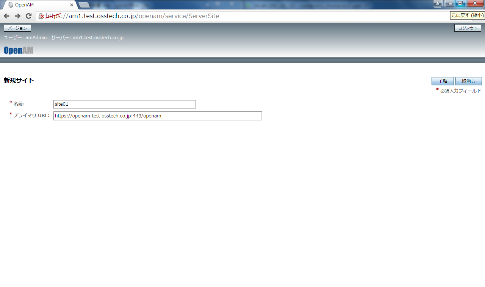

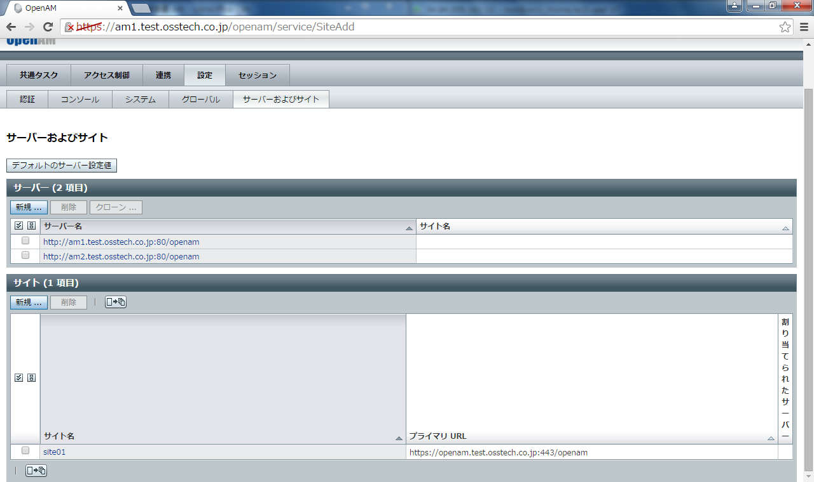

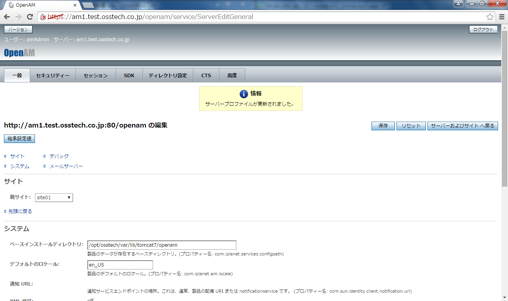

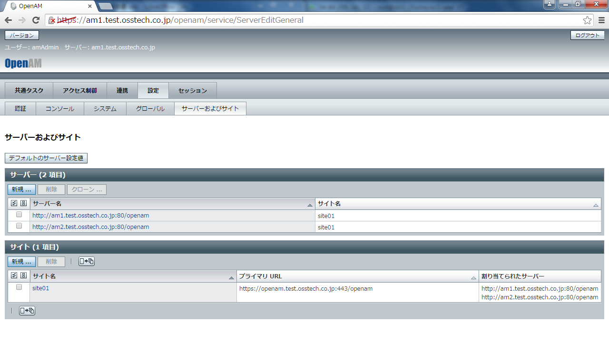

## 一般ユーザー用ログインURLの確認

### スティッキーの確認(1)
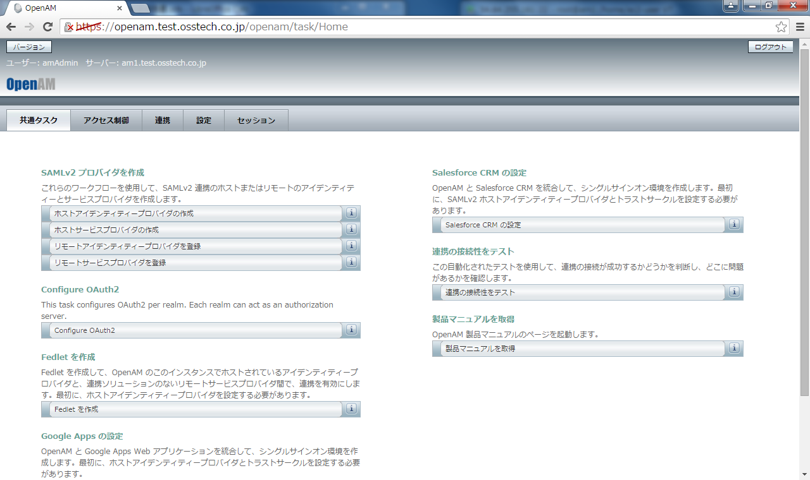

### スティッキーの確認(2)

## ユーザー用のサブレルムを作成する
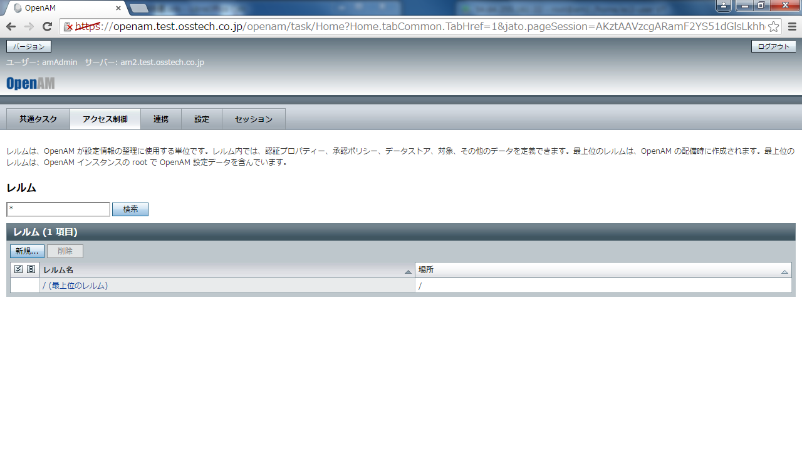

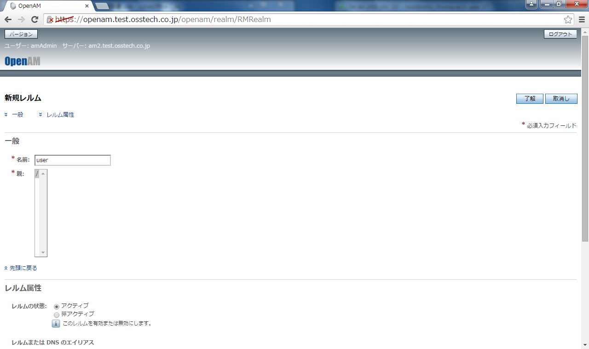

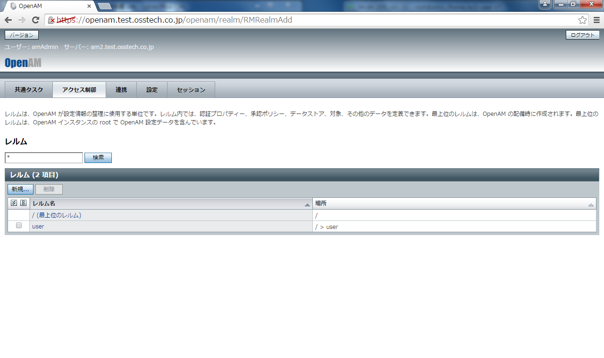

## DNSエイリアスを設定する

### トップレルムからサイトのFQDNを削除する
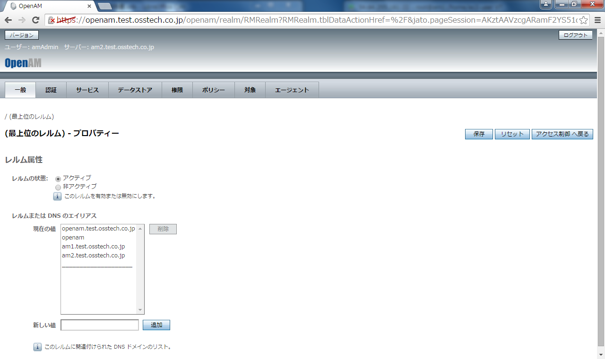

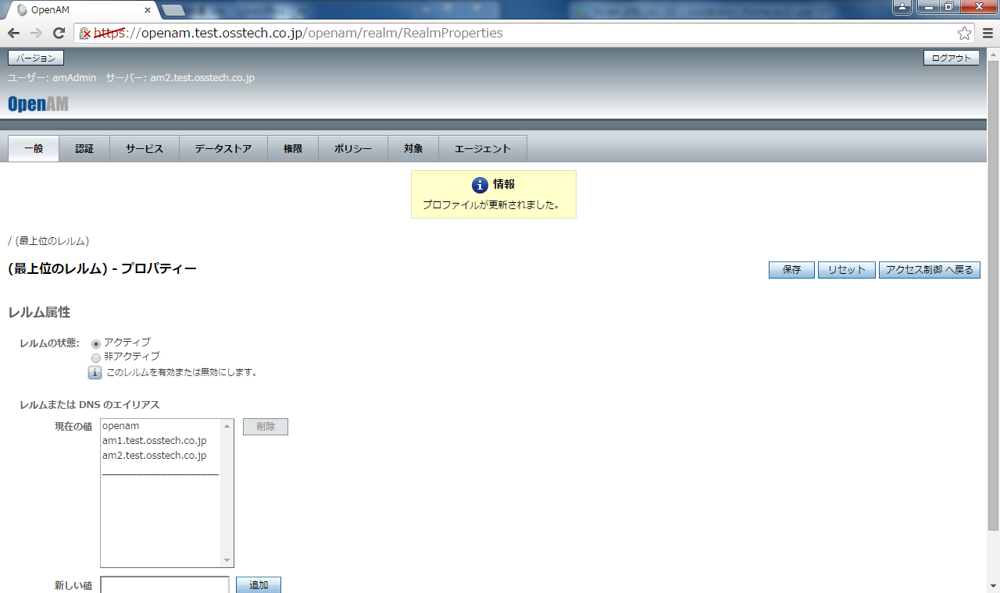

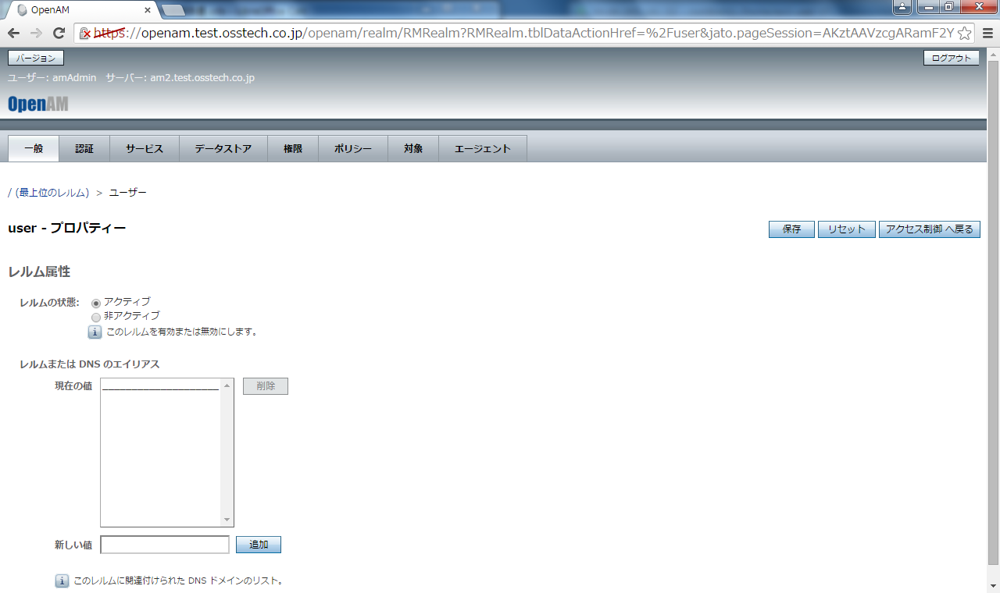

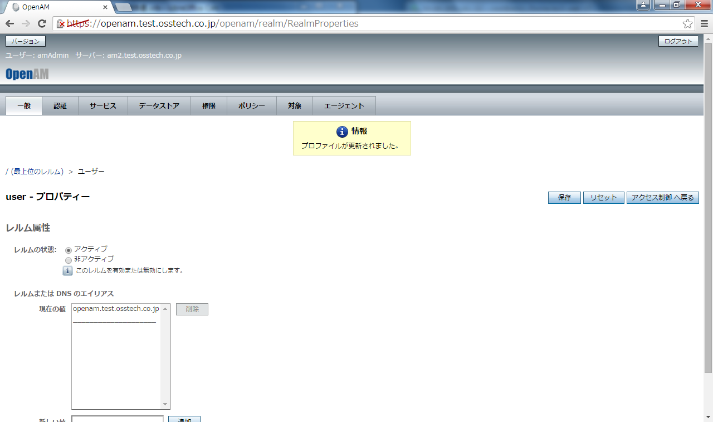

## 一般ユーザー用ログインURLの確認（レルム分割後）

### 管理者ユーザーでログインできないことの確認
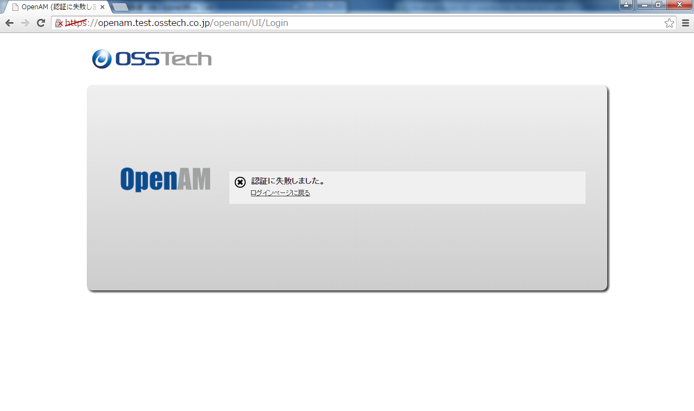

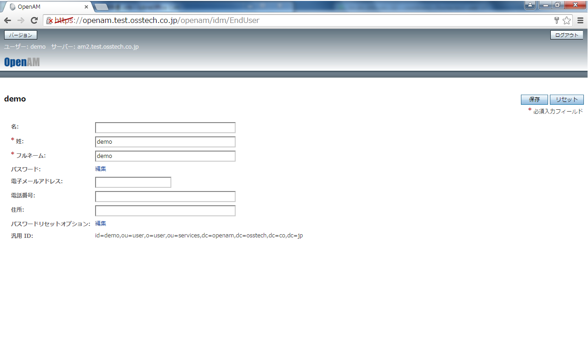
